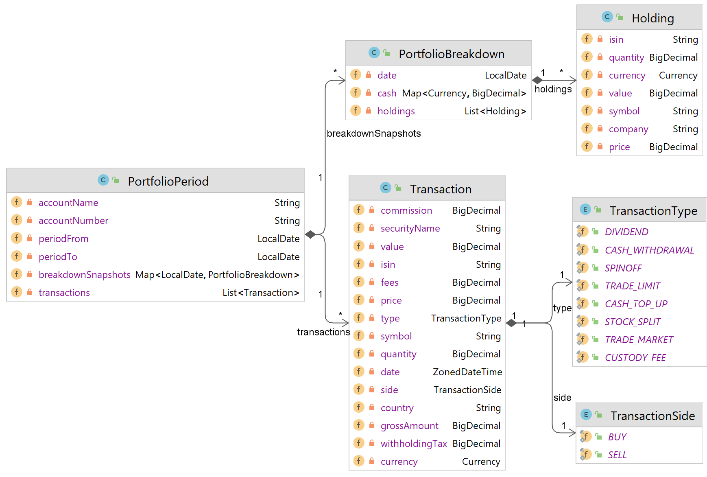

# Brinvex-Util-Revolut

## Introduction

_Brinvex-Util-Revolut_ is a compact Java library which enables developers 
to easily extract and work with data from Revolut trading account reports.

Working with Revolut trading account files is often a tedious work. 
Various account statements and reports coming from mobile app or webapp 
contain different bunch of data with different level of details. 
One example of many nuances Revolut has is that the _profit-and-loss-pdf_ report 
contains information about dividends withholding tax but
_profit-and-loss-csv_, _account-statement-pdf_, _account-statement-csv_ do not.

**_Brinvex-Util-Revolut_ extracts and consolidates data coming from various
Revolut report formats and makes them available in simple consistent form for further processing.**

## How to use it
 
- Add dependencies
````
<dependency>
    <groupId>com.brinvex.util</groupId>
    <artifactId>brinvex-util-revolut-api</artifactId>
    <version>4.1.0</version>
</dependency>
<dependency>
    <groupId>com.brinvex.util</groupId>
    <artifactId>brinvex-util-revolut-impl</artifactId>
    <version>4.1.0</version>
    <scope>runtime</scope>
</dependency>
````
- Process many _trading-account-statement_ or _profit-and-loss-statement_ PDF files and enjoy the result 
````
RevolutService revolutSvc = RevolutServiceFactory.INSTANCE.getService(); 

PortfolioPeriod ptfPeriod = revolutSvc.processStatements(List.of(
    "c:/tmp/trading-account-statement-2021.pdf",    
    "c:/tmp/trading-account-statement-2022.pdf",    
    "c:/tmp/profit-and-loss-statement-2021.pdf",    
    "c:/tmp/profit-and-loss-statement-2022.pdf",    
));
````



### Requirements
- Java 11 or above

### License

- The _Brinvex-Util-Revolut_ is released under version 2.0 of the Apache License.
